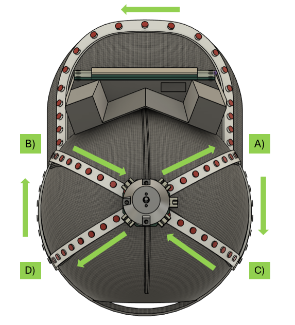

## Návod na složení

Stránka vysvětluje konstrukci dvou boxů a LED pásku.

### Display box
Držák baterie vložíme do prostoru označeného číslem 2), protáhneme kabely horním a spodním otvorem. Šroubkem ve středu dílu ho uchytíme k výtisku.
Do válcových děr označených číslem 1) a 3) je nutné zatavit měděný metrický závit velikosti M2.5 (vysvětleno níže). Do závitů vložit distanční sloupek velikosti M2.5, na šroubky závitů 1) následně vložit osazené PCB, které se poté uchytí maticemi. Násleně zvenku protlačit vypínací tlačítko.
K PCB s mikroprocesorem přichytit dráty z baterií, konektor od displaye a konektor na LED pásky a dráty od zapínacího tlačítka.
Na šrouby distančních sloupků 3) se vloží PCB displaye, šrouby se utáhnou maticí. Display takto uzavírá celou krabičku, pro finální sestavení výrobku je dobré zakápnout závit pomocí lepidla Loctite.

### Top Box
K desce (top board) bude přišroubován vytištěný kryt, který bude zakrývat celý motor ze stran a seshora. Nahoře uprostřed je díra pro výstupní hřídel a dvě díry na šrouby, které uchytí horní mosazný rám převodovky. Závity v rámu jsou podle dokumentace M1,8, tak snad se najdou vhodné šrouby (dělali to čiňani). Model krytu je také hotový, stačí ho vytisknout. Vnitřní dutina je o něco větší než motor. Je možné toleranci snížit a dutinu změnšit, aby motor seděl v krytu pevněji. Pokud se ale povede přišroubovat seshora, nemělo by to být potřeba.

### Zatavení závitové vložky
Měděný závit (který má průměr menší než vytisknutá díra) se vloží do díry (zasekne se o zuby po obvodu). Bodovou páječku zapneme na nižší než pájecí teplotu a položíme na závit, aplikujeme mírný tlak a závit se po chvíli zataví do plastu. 

### LED pásky
LED pásek bude při konstrukci nastřihaný, ale ve výsledku pospojovaný, aby tvořil jeden nepřerušený pásek s jedním začátkem a koncem.

Při konstrukci je potřeba nejdříve změřit délku LED pásku na daný prostor, poté ustřihnout a nalepit na spodní část suchý zip. V záhybech (jako například na kšiltu) je možné pásek nastřihat vícekrát pro hladší oblouk, na obrázcích projektu je zobrazen ohyb jen jako ilustrace výsledku.

Pásek začíná v bodě A), je nutné zde připájet na plochy LED pásku dráty napájení a komunikace vedoucí do Display boxu. z bodu A) pásek dvěma zalomeními pokračuje přes kšilt do bodu B). Dále přes Top Box dorazí zpět do bodu A) (Pozor, top box by měl mít správnou orientaci s konektorem na pravé části kšiltovky). Dále pásek pokračuje do Bodu D), poté před Top box to bodu C) a končí v bodě B).

