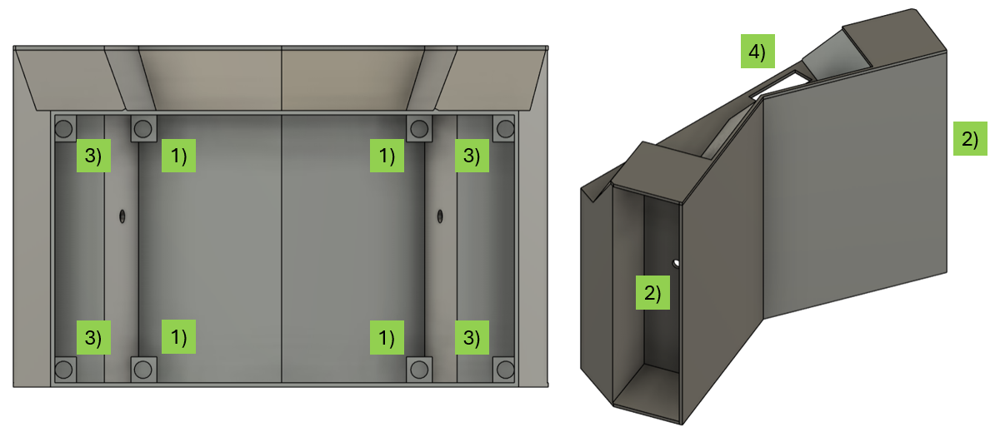

## Návod na složení

### box
Držák baterie vložíme do prostoru označeného číslem 2), protáhneme kabely horním a spodním otvorem. Šroubkem ve středu dílu ho uchytíme k výtisku.
Do válcových děr označených číslem 1) a 3) je nutné zatavit měděný metrický závit velikosti M2.5 (vysvětleno níže). Do závitů vložit distanční sloupek velikosti M2.5, na šroubky závitů 1) následně vložit PCB, které se poté uchytí maticí.
K PCB s mikroprocesorem přichytit dráty z baterií, konektor od displaye a konektor na LED pásky (a další?)
Na šrouby distančních sloupků 3) se vloží PCB displaye, šrouby se utáhnou maticí. Display takto uzavírá celou krabičku, pro finální sestavení výrobku je dobré zakápnout závit pomocí lepidla Loctite

### Zatavení závitové vložky
Měděný závit (který má průměr menší než vytisknutá díra) se vloží do díry (zasekne se o zuby po obvodu). Bodovou páječku zapneme na nižší než pájecí teplotu a položíme na závit, aplikujeme mírný tlak a závit se po chvíli zataví do plastu. 

### LED pásky

